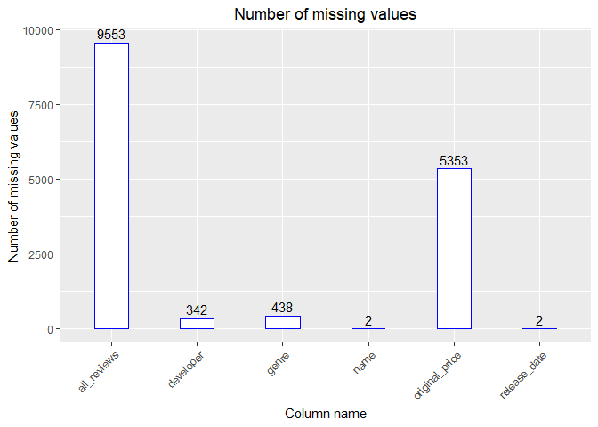
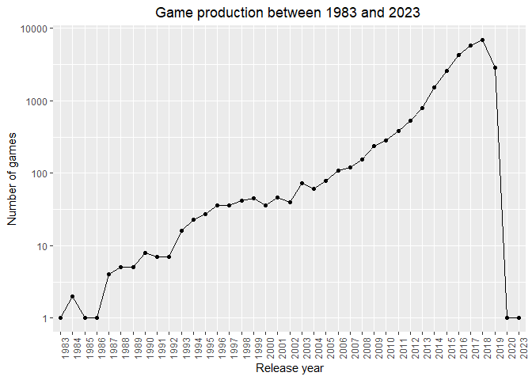
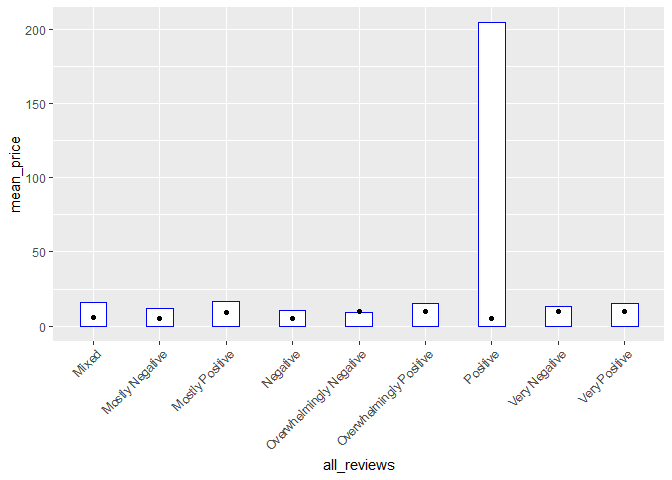

Mini Data Analysis Milestone 2
================

*To complete this milestone, you can either edit [this `.rmd`
file](https://raw.githubusercontent.com/UBC-STAT/stat545.stat.ubc.ca/master/content/mini-project/mini-project-2.Rmd)
directly. Fill in the sections that are commented out with
`<!--- start your work here--->`. When you are done, make sure to knit
to an `.md` file by changing the output in the YAML header to
`github_document`, before submitting a tagged release on canvas.*

# Welcome to the rest of your mini data analysis project!

In Milestone 1, you explored your data. and came up with research
questions. This time, we will finish up our mini data analysis and
obtain results for your data by:

- Making summary tables and graphs
- Manipulating special data types in R: factors and/or dates and times.
- Fitting a model object to your data, and extract a result.
- Reading and writing data as separate files.

We will also explore more in depth the concept of *tidy data.*

**NOTE**: The main purpose of the mini data analysis is to integrate
what you learn in class in an analysis. Although each milestone provides
a framework for you to conduct your analysis, it’s possible that you
might find the instructions too rigid for your data set. If this is the
case, you may deviate from the instructions – just make sure you’re
demonstrating a wide range of tools and techniques taught in this class.

# Instructions

**To complete this milestone**, edit [this very `.Rmd`
file](https://raw.githubusercontent.com/UBC-STAT/stat545.stat.ubc.ca/master/content/mini-project/mini-project-2.Rmd)
directly. Fill in the sections that are tagged with
`<!--- start your work here--->`.

**To submit this milestone**, make sure to knit this `.Rmd` file to an
`.md` file by changing the YAML output settings from
`output: html_document` to `output: github_document`. Commit and push
all of your work to your mini-analysis GitHub repository, and tag a
release on GitHub. Then, submit a link to your tagged release on canvas.

**Points**: This milestone is worth 50 points: 45 for your analysis, and
5 for overall reproducibility, cleanliness, and coherence of the Github
submission.

**Research Questions**: In Milestone 1, you chose two research questions
to focus on. Wherever realistic, your work in this milestone should
relate to these research questions whenever we ask for justification
behind your work. In the case that some tasks in this milestone don’t
align well with one of your research questions, feel free to discuss
your results in the context of a different research question.

# Learning Objectives

By the end of this milestone, you should:

- Understand what *tidy* data is, and how to create it using `tidyr`.
- Generate a reproducible and clear report using R Markdown.
- Manipulating special data types in R: factors and/or dates and times.
- Fitting a model object to your data, and extract a result.
- Reading and writing data as separate files.

# Setup

Begin by loading your data and the tidyverse package below:

``` r
library(datateachr) # <- might contain the data you picked!
library(tidyverse)
```

# Task 1: Process and summarize your data

From milestone 1, you should have an idea of the basic structure of your
dataset (e.g. number of rows and columns, class types, etc.). Here, we
will start investigating your data more in-depth using various data
manipulation functions.

### 1.1 (1 point)

First, write out the 4 research questions you defined in milestone 1
were. This will guide your work through milestone 2:

<!-------------------------- Start your work below ---------------------------->

***Answer:***

1.  In this Mini data analysis, observations missing data have not been
    considered. For Milestone 2, I want to create a new tibble by
    replacing appropriate values or removing observation appropriately
    by studying the data more.

2.  I want to understand the growth in the number of games over time,
    along with growth of popular genres identified here.

3.  I want to analyse which genres have the most positive review, is
    there a relation between this positive review and price of the games
    in the genre.

4.  I want to determine which game studio has produced the games with
    positive reviews.

<!----------------------------------------------------------------------------->

Here, we will investigate your data using various data manipulation and
graphing functions.

### 1.2 (8 points)

Now, for each of your four research questions, choose one task from
options 1-4 (summarizing), and one other task from 4-8 (graphing). You
should have 2 tasks done for each research question (8 total). Make sure
it makes sense to do them! (e.g. don’t use a numerical variables for a
task that needs a categorical variable.). Comment on why each task helps
(or doesn’t!) answer the corresponding research question.

Ensure that the output of each operation is printed!

Also make sure that you’re using dplyr and ggplot2 rather than base R.
Outside of this project, you may find that you prefer using base R
functions for certain tasks, and that’s just fine! But part of this
project is for you to practice the tools we learned in class, which is
dplyr and ggplot2.

**Summarizing:**

1.  Compute the *range*, *mean*, and *two other summary statistics* of
    **one numerical variable** across the groups of **one categorical
    variable** from your data.
2.  Compute the number of observations for at least one of your
    categorical variables. Do not use the function `table()`!
3.  Create a categorical variable with 3 or more groups from an existing
    numerical variable. You can use this new variable in the other
    tasks! *An example: age in years into “child, teen, adult, senior”.*
4.  Compute the proportion and counts in each category of one
    categorical variable across the groups of another categorical
    variable from your data. Do not use the function `table()`!

**Graphing:**

6.  Create a graph of your choosing, make one of the axes logarithmic,
    and format the axes labels so that they are “pretty” or easier to
    read.
7.  Make a graph where it makes sense to customize the alpha
    transparency.

Using variables and/or tables you made in one of the “Summarizing”
tasks:

8.  Create a graph that has at least two geom layers.
9.  Create 3 histograms, with each histogram having different sized
    bins. Pick the “best” one and explain why it is the best.

Make sure it’s clear what research question you are doing each operation
for!

<!------------------------- Start your work below ----------------------------->

***Question 1:*** In this Mini data analysis, observations missing data
have not been considered. For Milestone 2, I want to create a new tibble
by replacing appropriate values or removing observation appropriately by
studying the data more.

***Summarizing task**:* Compute the number of observations for at least
one of your categorical variables. Do not use the function `table()`!

``` r
#Reviewing the contents of the dataset
head(steam_games)
```

    ## # A tibble: 6 × 21
    ##      id url     types name  desc_snippet recent_reviews all_reviews release_date
    ##   <dbl> <chr>   <chr> <chr> <chr>        <chr>          <chr>       <chr>       
    ## 1     1 https:… app   DOOM  Now include… Very Positive… Very Posit… May 12, 2016
    ## 2     2 https:… app   PLAY… PLAYERUNKNO… Mixed,(6,214)… Mixed,(836… Dec 21, 2017
    ## 3     3 https:… app   BATT… Take comman… Mixed,(166),-… Mostly Pos… Apr 24, 2018
    ## 4     4 https:… app   DayZ  The post-so… Mixed,(932),-… Mixed,(167… Dec 13, 2018
    ## 5     5 https:… app   EVE … EVE Online … Mixed,(287),-… Mostly Pos… May 6, 2003 
    ## 6     6 https:… bund… Gran… Grand Theft… NaN            NaN         NaN         
    ## # ℹ 13 more variables: developer <chr>, publisher <chr>, popular_tags <chr>,
    ## #   game_details <chr>, languages <chr>, achievements <dbl>, genre <chr>,
    ## #   game_description <chr>, mature_content <chr>, minimum_requirements <chr>,
    ## #   recommended_requirements <chr>, original_price <dbl>, discount_price <dbl>

At first, the whole dataset is not needed in order to answer my research
questions. I only need a portion of the dataset. So, I am going to
select the columns that are need to answer the questions I have listed.

``` r
sg_new = steam_games %>%
  select("name", "all_reviews", "release_date", "developer", "genre", "original_price")

head(sg_new)
```

    ## # A tibble: 6 × 6
    ##   name                   all_reviews release_date developer genre original_price
    ##   <chr>                  <chr>       <chr>        <chr>     <chr>          <dbl>
    ## 1 DOOM                   Very Posit… May 12, 2016 id Softw… Acti…           20.0
    ## 2 PLAYERUNKNOWN'S BATTL… Mixed,(836… Dec 21, 2017 PUBG Cor… Acti…           30.0
    ## 3 BATTLETECH             Mostly Pos… Apr 24, 2018 Harebrai… Acti…           40.0
    ## 4 DayZ                   Mixed,(167… Dec 13, 2018 Bohemia … Acti…           45.0
    ## 5 EVE Online             Mostly Pos… May 6, 2003  CCP       Acti…            0  
    ## 6 Grand Theft Auto V: P… NaN         NaN          Rockstar… Acti…           NA

``` r
#Splitting multiple comma separated values into individual entries and summarizing the number of games in each genre

sg_genre_split <- sg_new %>%
  mutate(genre = strsplit(as.character(genre), ",")) %>%
  unnest(genre)

games_per_genre <- sg_genre_split %>%
  group_by(genre) %>%
  summarise(num_games = n())

#Analyzing the last 6 entries to see if there are any missing values
tail(games_per_genre)
```

    ## # A tibble: 6 × 2
    ##   genre            num_games
    ##   <chr>                <int>
    ## 1 Utilities              507
    ## 2 Valve                    4
    ## 3 Video Production       175
    ## 4 Violent                138
    ## 5 Web Publishing         438
    ## 6 <NA>                   438

***Graphing task:*** Create a graph that has at least two geom layers.

``` r
#Counting the number of missing values in each column
missing_values <- sg_new %>%
    gather(key = "key", value = "val") %>%
    mutate(is_missing = is.na(val)) %>%
    group_by(key, is_missing) %>%
    summarise(num_missing = n()) %>%
    filter(is_missing == T) %>%
    select(-is_missing) %>%
    arrange(desc(num_missing))
```

    ## `summarise()` has grouped output by 'key'. You can override using the `.groups`
    ## argument.

``` r
print(missing_values)
```

    ## # A tibble: 6 × 2
    ## # Groups:   key [6]
    ##   key            num_missing
    ##   <chr>                <int>
    ## 1 all_reviews           9553
    ## 2 original_price        5353
    ## 3 genre                  438
    ## 4 developer              342
    ## 5 name                     2
    ## 6 release_date             2

``` r
missing_values %>%
  ggplot() +
  geom_bar(aes(x=key, y=num_missing), stat = 'identity', width = 0.4, color = "blue", fill = "white") +
  labs(x='Column name', y="Number of missing values", title='Number of missing values') +
  theme(plot.title = element_text(hjust = 0.5), axis.text.x = element_text(angle = 45, hjust = 1)) +
  geom_text(aes(x=key, y=num_missing, label = num_missing),
    vjust = -0.4
  )
```

<!-- -->

***Question 2:*** I want to understand the growth in the number of games
over time, along with growth of popular genres identified here.

***Summarizing task**:* Compute the number of observations for at least
one of your categorical variables. Do not use the function `table()`!

In order to change the release_date column into integer from string, the
tsibble package is required.

``` r
#install.packages('tsibble')
```

``` r
library('tsibble')
```

    ## 
    ## Attaching package: 'tsibble'

    ## The following object is masked from 'package:lubridate':
    ## 
    ##     interval

    ## The following objects are masked from 'package:base':
    ## 
    ##     intersect, setdiff, union

First the column data is formatted to date, then the release year is
extracted from the whole date. After getting the year, the number of
games released per year is summarized and plotted.

``` r
sg_date_edit <- sg_new %>%
  drop_na() %>%
  mutate(date = as.Date(release_date, format = "%B %e, %Y")) %>%
  mutate(release_year = format(date, format = "%Y")) %>%
  select(-date, -release_date)

games_per_year <- sg_date_edit %>%
  group_by(release_year) %>%
  summarise(num_games_per_year = n()) %>%
  arrange(release_year)
  
head(games_per_year)
```

    ## # A tibble: 6 × 2
    ##   release_year num_games_per_year
    ##   <chr>                     <int>
    ## 1 1983                          1
    ## 2 1984                          2
    ## 3 1985                          1
    ## 4 1986                          1
    ## 5 1987                          4
    ## 6 1988                          5

***Graphing task:*** Create a graph of your choosing, make one of the
axes logarithmic, and format the axes labels so that they are “pretty”
or easier to read.

``` r
#Line plot showing the increase in the game production over years.

ggplot(games_per_year[1:39,], aes(x = release_year, y = num_games_per_year, group = 1))+
  geom_line() +
  geom_point() +
  scale_y_log10()+
  labs(x='Release year', y="Number of games", title='Game production between 1983 and 2023 ')+
  theme(plot.title = element_text(hjust = 0.5), axis.text.x = element_text(angle = 90)) 
```

<!-- -->

***Question 3:*** I want to analyse which genres have the most positive
review, is there a relation between this positive review and price of
the games in the genre.

***Summarizing task**:* Compute the *range*, *mean*, and *two other
summary statistics* of **one numerical variable** across the groups of
**one categorical variable** from your data.

In order to analyse review, at first the category of a review is
determined by strsplit by taking the first word of all_reviews column.
Eg: Positive. From those reviews 9 categories are filtered out.

``` r
sg_review_analysis <- sg_date_edit %>% 
  mutate(all_reviews = sapply(strsplit((all_reviews), ","), `[`, 1)) %>%
  unnest(all_reviews) %>%
  filter(all_reviews %in% c("Mixed", "Mostly Negative", "Mostly Positive", "Negative", "Overwhelmingly Negative", "Overwhelmingly Positive", "Positive", "Very Negative", "Very Positive"))
```

The mean price across each review is determined to see if there is a
relationship between the review and price.

``` r
mean_price_summary <- sg_review_analysis %>%
  group_by(all_reviews) %>%
  summarise(mean_price = mean(original_price)) %>%
  arrange(mean_price)

mean_price_summary
```

    ## # A tibble: 9 × 2
    ##   all_reviews             mean_price
    ##   <chr>                        <dbl>
    ## 1 Overwhelmingly Negative       9.13
    ## 2 Negative                     10.4 
    ## 3 Mostly Negative              12.2 
    ## 4 Very Negative                13.5 
    ## 5 Overwhelmingly Positive      15.1 
    ## 6 Very Positive                15.1 
    ## 7 Mixed                        16.1 
    ## 8 Mostly Positive              16.5 
    ## 9 Positive                    205.

``` r
range_price_summary <- sg_review_analysis %>%
  group_by(all_reviews) %>%
  summarise(range_price = max(original_price) - min(original_price)) %>%
  arrange(range_price)

range_price_summary
```

    ## # A tibble: 9 × 2
    ##   all_reviews             range_price
    ##   <chr>                         <dbl>
    ## 1 Overwhelmingly Negative         19 
    ## 2 Very Negative                   59 
    ## 3 Negative                       111.
    ## 4 Overwhelmingly Positive        502.
    ## 5 Very Positive                  502.
    ## 6 Mixed                          625.
    ## 7 Mostly Negative                625.
    ## 8 Mostly Positive                625.
    ## 9 Positive                    650560

``` r
median_price_summary <- sg_review_analysis %>%
  group_by(all_reviews) %>%
  summarise(median_price = median(original_price)) %>%
  arrange(median_price)

median_price_summary
```

    ## # A tibble: 9 × 2
    ##   all_reviews             median_price
    ##   <chr>                          <dbl>
    ## 1 Mostly Negative                 4.99
    ## 2 Negative                        4.99
    ## 3 Positive                        4.99
    ## 4 Mixed                           5.99
    ## 5 Mostly Positive                 8.99
    ## 6 Overwhelmingly Negative         9.99
    ## 7 Overwhelmingly Positive         9.99
    ## 8 Very Negative                   9.99
    ## 9 Very Positive                   9.99

``` r
IQR_price_summary <- sg_review_analysis %>%
  group_by(all_reviews) %>%
  summarise(IQR_price = IQR(original_price)) %>%
  arrange(IQR_price)

IQR_price_summary
```

    ## # A tibble: 9 × 2
    ##   all_reviews             IQR_price
    ##   <chr>                       <dbl>
    ## 1 Overwhelmingly Negative       3.5
    ## 2 Positive                      8  
    ## 3 Negative                      9  
    ## 4 Mostly Negative              10  
    ## 5 Very Positive                11.8
    ## 6 Mostly Positive              12  
    ## 7 Very Negative                12.2
    ## 8 Mixed                        13  
    ## 9 Overwhelmingly Positive      15

***Graphing task:*** Create a graph that has at least two geom layers.

Merging mean price and median price.

``` r
merged_price_summary <- merge(mean_price_summary,median_price_summary,by="all_reviews") 
head(merged_price_summary)
```

    ##               all_reviews mean_price median_price
    ## 1                   Mixed  16.101534         5.99
    ## 2         Mostly Negative  12.234117         4.99
    ## 3         Mostly Positive  16.510945         8.99
    ## 4                Negative  10.351783         4.99
    ## 5 Overwhelmingly Negative   9.132857         9.99
    ## 6 Overwhelmingly Positive  15.059968         9.99

Plotting both mean and median price.

``` r
  ggplot(merged_price_summary)+
  geom_bar(aes(x = all_reviews, y = mean_price),stat = 'identity', width = 0.4, color = "blue", fill = "white")+
  theme(plot.title = element_text(hjust = 0.5), axis.text.x = element_text(angle = 45, hjust = 1))+
  geom_point(aes(x = all_reviews, y = median_price))
```

<!-- -->

***Question 4:*** I want to determine which game studio has produced the
games with positive reviews.

***Summarizing task**:* Compute the number of observations for at least
one of your categorical variables. Do not use the function `table()`! -
As computing number of observations would not be appropriate for the
task, I have computed the mean observation.

``` r
#Encoded reviews with values

sg_review_analysis$all_reviews = factor(sg_review_analysis$all_reviews,
               levels = c("Overwhelmingly Negative", "Very Negative", "Negative", "Mostly Negative", "Mixed", "Mostly Positive", "Positive", "Very Positive", "Overwhelmingly Positive"),
               labels = c(-4,-3,-2,-1,0,1,2,3,4))

head(sg_review_analysis)
```

    ## # A tibble: 6 × 6
    ##   name                   all_reviews developer genre original_price release_year
    ##   <chr>                  <fct>       <chr>     <chr>          <dbl> <chr>       
    ## 1 DOOM                   3           id Softw… Acti…           20.0 2016        
    ## 2 PLAYERUNKNOWN'S BATTL… 0           PUBG Cor… Acti…           30.0 2017        
    ## 3 BATTLETECH             1           Harebrai… Acti…           40.0 2018        
    ## 4 DayZ                   0           Bohemia … Acti…           45.0 2018        
    ## 5 EVE Online             1           CCP       Acti…            0   2003        
    ## 6 Devil May Cry 5        3           CAPCOM C… Acti…           60.0 2019

``` r
#Selected positive reviews, determined their sum to know most positive developer.
sg_review_analysis %>%
  filter(all_reviews %in% c(1,2,3,4)) %>%
  group_by(developer) %>%
  summarise(sum_rev = sum(as.numeric(as.character(all_reviews)))) %>%
  arrange(-sum_rev)
```

    ## # A tibble: 6,817 × 2
    ##    developer                  sum_rev
    ##    <chr>                        <dbl>
    ##  1 SCS Software                   163
    ##  2 Dovetail Games                 152
    ##  3 CAPCOM Co., Ltd.               122
    ##  4 Choice of Games                 98
    ##  5 KOEI TECMO GAMES CO., LTD.      78
    ##  6 Valve                           75
    ##  7 Paradox Development Studio      69
    ##  8 Capcom                          67
    ##  9 Rebellion                       66
    ## 10 Quiet River                     65
    ## # ℹ 6,807 more rows

``` r
head(sg_review_analysis)
```

    ## # A tibble: 6 × 6
    ##   name                   all_reviews developer genre original_price release_year
    ##   <chr>                  <fct>       <chr>     <chr>          <dbl> <chr>       
    ## 1 DOOM                   3           id Softw… Acti…           20.0 2016        
    ## 2 PLAYERUNKNOWN'S BATTL… 0           PUBG Cor… Acti…           30.0 2017        
    ## 3 BATTLETECH             1           Harebrai… Acti…           40.0 2018        
    ## 4 DayZ                   0           Bohemia … Acti…           45.0 2018        
    ## 5 EVE Online             1           CCP       Acti…            0   2003        
    ## 6 Devil May Cry 5        3           CAPCOM C… Acti…           60.0 2019

***Graphing task:***

<!----------------------------------------------------------------------------->

### 1.3 (2 points)

Based on the operations that you’ve completed, how much closer are you
to answering your research questions? Think about what aspects of your
research questions remain unclear. Can your research questions be
refined, now that you’ve investigated your data a bit more? Which
research questions are yielding interesting results?

<!------------------------- Write your answer here ---------------------------->

***Answer:***

I identified that my research questions are complicated than I expected
them to be. There are several problems with the dataset:  
1. The dataset has many missing data in both numerical and non-numerical
attributes. All missing data are not marked as NA, some are noted as
“NaN strings. So it is hard to come to a conclusion on what can be done
about the missing data.  
2. Data formats are untidy, they contain too much information so
relevant details need to be extracted.  
3. The data contains outliers which cause wrong results when certain
summary statistics are determined.

In few research questions, I have embedded 2 questions as part of one,
which needs to be avoided.

In question 4, I wanted to know the relationship between developer and
price of the game, however there are more than 17000 unique developers,
so the question should be refined to identify developer which have high
original_price.

In general, I found that all my questions have interesting results,
every operation performed on the dataset reveals the problems in it
which need to be continously tackled to perform an analysis.

<!----------------------------------------------------------------------------->

# Task 2: Tidy your data

In this task, we will do several exercises to reshape our data. The goal
here is to understand how to do this reshaping with the `tidyr` package.

A reminder of the definition of *tidy* data:

- Each row is an **observation**
- Each column is a **variable**
- Each cell is a **value**

### 2.1 (2 points)

Based on the definition above, can you identify if your data is tidy or
untidy? Go through all your columns, or if you have \>8 variables, just
pick 8, and explain whether the data is untidy or tidy.

<!--------------------------- Start your work below --------------------------->

***Answer:***

First, I want to determine the total number of columns in steam games
dataset.

``` r
ncol(steam_games)
```

    ## [1] 21

Now, I want to determine the number of columns in the subset of
steam_games, sg_new chosen as part of the analysis.

``` r
ncol(sg_new)
```

    ## [1] 6

In order to answer the question, 6 columns of sg_new and 2 more columns
from steam games would be considered.

| Column name    | State  |
|----------------|--------|
| name           | tidy   |
| all_reviews    | untidy |
| release_date   | tidy   |
| developer      | tidy   |
| genre          | untidy |
| original_price | tidy   |
| types          | tidy   |
| languages      | untidy |

<!----------------------------------------------------------------------------->

### 2.2 (4 points)

Now, if your data is tidy, untidy it! Then, tidy it back to it’s
original state.

If your data is untidy, then tidy it! Then, untidy it back to it’s
original state.

Be sure to explain your reasoning for this task. Show us the “before”
and “after”.

<!--------------------------- Start your work below --------------------------->

***Answer:***

***Tidying genre***

``` r
head(steam_games$genre)
```

    ## [1] "Action"                                                
    ## [2] "Action,Adventure,Massively Multiplayer"                
    ## [3] "Action,Adventure,Strategy"                             
    ## [4] "Action,Adventure,Massively Multiplayer"                
    ## [5] "Action,Free to Play,Massively Multiplayer,RPG,Strategy"
    ## [6] "Action,Adventure"

``` r
sg_new_genre = steam_games %>%
  select(genre) %>%
  separate_longer_delim(genre, ",")

head(sg_new_genre)
```

    ## # A tibble: 6 × 1
    ##   genre                
    ##   <chr>                
    ## 1 Action               
    ## 2 Action               
    ## 3 Adventure            
    ## 4 Massively Multiplayer
    ## 5 Action               
    ## 6 Adventure

***Tidying all_reviews***

``` r
sg_sep_all_reviews = steam_games %>%
  select(all_reviews) %>%
  separate(all_reviews, c("review_category", "extra_review"), ",", extra = "merge", fill = "left")

head(sg_sep_all_reviews)
```

    ## # A tibble: 6 × 2
    ##   review_category extra_review                                                  
    ##   <chr>           <chr>                                                         
    ## 1 Very Positive   (42,550),- 92% of the 42,550 user reviews for this game are p…
    ## 2 Mixed           (836,608),- 49% of the 836,608 user reviews for this game are…
    ## 3 Mostly Positive (7,030),- 71% of the 7,030 user reviews for this game are pos…
    ## 4 Mixed           (167,115),- 61% of the 167,115 user reviews for this game are…
    ## 5 Mostly Positive (11,481),- 74% of the 11,481 user reviews for this game are p…
    ## 6 <NA>            NaN

***Untidying all_reviews***

``` r
sg_united_all_reviews <- sg_sep_all_reviews %>%
  unite("all_reviews", review_category:extra_review, sep=",")

head(sg_united_all_reviews)
```

    ## # A tibble: 6 × 1
    ##   all_reviews                                                                   
    ##   <chr>                                                                         
    ## 1 Very Positive,(42,550),- 92% of the 42,550 user reviews for this game are pos…
    ## 2 Mixed,(836,608),- 49% of the 836,608 user reviews for this game are positive. 
    ## 3 Mostly Positive,(7,030),- 71% of the 7,030 user reviews for this game are pos…
    ## 4 Mixed,(167,115),- 61% of the 167,115 user reviews for this game are positive. 
    ## 5 Mostly Positive,(11,481),- 74% of the 11,481 user reviews for this game are p…
    ## 6 NA,NaN

***Tidying languages***

``` r
#Tidying languages
```

<!----------------------------------------------------------------------------->

### 2.3 (4 points)

Now, you should be more familiar with your data, and also have made
progress in answering your research questions. Based on your interest,
and your analyses, pick 2 of the 4 research questions to continue your
analysis in the remaining tasks:

<!-------------------------- Start your work below ---------------------------->

Question 1 and Question 2.

1.  In this Mini data analysis, observations missing data have not been
    considered. For Milestone 2, I want to create a new tibble by
    replacing appropriate values or removing observation appropriately
    by studying the data more.

2.  I want to understand the growth in the number of games over time,
    along with growth of popular genres identified here.

<!----------------------------------------------------------------------------->

Explain your decision for choosing the above two research questions.

<!--------------------------- Start your work below --------------------------->

Dealing with missing data is crucial part of analysis, as they lead to
misleading analysis. There seems to be a correlation between year and
the number of games produced, so the first and second question have been
chosen.

<!----------------------------------------------------------------------------->

Now, try to choose a version of your data that you think will be
appropriate to answer these 2 questions. Use between 4 and 8 functions
that we’ve covered so far (i.e. by filtering, cleaning, tidy’ing,
dropping irrelevant columns, etc.).

(If it makes more sense, then you can make/pick two versions of your
data, one for each research question.)

<!--------------------------- Start your work below --------------------------->

# Task 3: Modelling

## 3.0 (no points)

Pick a research question from 1.2, and pick a variable of interest
(we’ll call it “Y”) that’s relevant to the research question. Indicate
these.

<!-------------------------- Start your work below ---------------------------->

**Research Question**: Question 2: I want to understand the growth in
the number of games over time, along with growth of popular genres
identified here.

**Variable of interest**: In order to perform a summarizing operation on
the above question, date and number of games was considered. Number of
games is going to be considered as variable of interest.

<!----------------------------------------------------------------------------->

## 3.1 (3 points)

Fit a model or run a hypothesis test that provides insight on this
variable with respect to the research question. Store the model object
as a variable, and print its output to screen. We’ll omit having to
justify your choice, because we don’t expect you to know about model
specifics in STAT 545.

- **Note**: It’s OK if you don’t know how these models/tests work. Here
  are some examples of things you can do here, but the sky’s the limit.

  - You could fit a model that makes predictions on Y using another
    variable, by using the `lm()` function.
  - You could test whether the mean of Y equals 0 using `t.test()`, or
    maybe the mean across two groups are different using `t.test()`, or
    maybe the mean across multiple groups are different using `anova()`
    (you may have to pivot your data for the latter two).
  - You could use `lm()` to test for significance of regression
    coefficients.

<!-------------------------- Start your work below ---------------------------->

``` r
model <- lm(num_games_per_year ~ release_year, data = games_per_year)
print(model)
```

    ## 
    ## Call:
    ## lm(formula = num_games_per_year ~ release_year, data = games_per_year)
    ## 
    ## Coefficients:
    ##      (Intercept)  release_year1984  release_year1985  release_year1986  
    ##        1.000e+00         1.000e+00        -8.698e-13         3.063e-13  
    ## release_year1987  release_year1988  release_year1989  release_year1990  
    ##        3.000e+00         4.000e+00         4.000e+00         7.000e+00  
    ## release_year1991  release_year1992  release_year1993  release_year1994  
    ##        6.000e+00         6.000e+00         1.500e+01         2.200e+01  
    ## release_year1995  release_year1996  release_year1997  release_year1998  
    ##        2.600e+01         3.500e+01         3.500e+01         4.100e+01  
    ## release_year1999  release_year2000  release_year2001  release_year2002  
    ##        4.400e+01         3.500e+01         4.500e+01         3.900e+01  
    ## release_year2003  release_year2004  release_year2005  release_year2006  
    ##        7.100e+01         6.000e+01         7.800e+01         1.090e+02  
    ## release_year2007  release_year2008  release_year2009  release_year2010  
    ##        1.180e+02         1.520e+02         2.350e+02         2.790e+02  
    ## release_year2011  release_year2012  release_year2013  release_year2014  
    ##        3.830e+02         5.280e+02         7.950e+02         1.531e+03  
    ## release_year2015  release_year2016  release_year2017  release_year2018  
    ##        2.602e+03         4.308e+03         5.777e+03         6.978e+03  
    ## release_year2019  release_year2020  release_year2023  
    ##        2.876e+03         1.969e-12         1.969e-12

<!----------------------------------------------------------------------------->

## 3.2 (3 points)

Produce something relevant from your fitted model: either predictions on
Y, or a single value like a regression coefficient or a p-value.

- Be sure to indicate in writing what you chose to produce.
- Your code should either output a tibble (in which case you should
  indicate the column that contains the thing you’re looking for), or
  the thing you’re looking for itself.
- Obtain your results using the `broom` package if possible. If your
  model is not compatible with the broom function you’re needing, then
  you can obtain your results by some other means, but first indicate
  which broom function is not compatible.

<!-------------------------- Start your work below ---------------------------->

``` r
a <- data.frame(release_year = as.character(2018))
print(predict(model, a))
```

    ##    1 
    ## 6979

<!----------------------------------------------------------------------------->

# Task 4: Reading and writing data

Get set up for this exercise by making a folder called `output` in the
top level of your project folder / repository. You’ll be saving things
there.

## 4.1 (3 points)

Take a summary table that you made from Task 1, and write it as a csv
file in your `output` folder. Use the `here::here()` function.

- **Robustness criteria**: You should be able to move your Mini Project
  repository / project folder to some other location on your computer,
  or move this very Rmd file to another location within your project
  repository / folder, and your code should still work.
- **Reproducibility criteria**: You should be able to delete the csv
  file, and remake it simply by knitting this Rmd file.

``` r
#install.packages("here")
```

``` r
library(here)
```

    ## here() starts at C:/Users/igsuw/OneDrive/Documents/mda-Suwethaig

<!-------------------------- Start your work below ---------------------------->

``` r
write.csv(games_per_year,file=here("output","games_per_year.csv"))
```

<!----------------------------------------------------------------------------->

## 4.2 (3 points)

Write your model object from Task 3 to an R binary file (an RDS), and
load it again. Be sure to save the binary file in your `output` folder.
Use the functions `saveRDS()` and `readRDS()`.

- The same robustness and reproducibility criteria as in 4.1 apply here.

<!-------------------------- Start your work below ---------------------------->

``` r
saveRDS(model, file = here("output","mymodel.rds"))
```

``` r
read_model <- readRDS(file = here("output", "mymodel.rds"))

a <- data.frame(release_year = as.character(2018))
predict(read_model,a )
```

    ##    1 
    ## 6979

<!----------------------------------------------------------------------------->

# Overall Reproducibility/Cleanliness/Coherence Checklist

Here are the criteria we’re looking for.

## Coherence (0.5 points)

The document should read sensibly from top to bottom, with no major
continuity errors.

The README file should still satisfy the criteria from the last
milestone, i.e. it has been updated to match the changes to the
repository made in this milestone.

## File and folder structure (1 points)

You should have at least three folders in the top level of your
repository: one for each milestone, and one output folder. If there are
any other folders, these are explained in the main README.

Each milestone document is contained in its respective folder, and
nowhere else.

Every level-1 folder (that is, the ones stored in the top level, like
“Milestone1” and “output”) has a `README` file, explaining in a sentence
or two what is in the folder, in plain language (it’s enough to say
something like “This folder contains the source for Milestone 1”).

## Output (1 point)

All output is recent and relevant:

- All Rmd files have been `knit`ted to their output md files.
- All knitted md files are viewable without errors on Github. Examples
  of errors: Missing plots, “Sorry about that, but we can’t show files
  that are this big right now” messages, error messages from broken R
  code
- All of these output files are up-to-date – that is, they haven’t
  fallen behind after the source (Rmd) files have been updated.
- There should be no relic output files. For example, if you were
  knitting an Rmd to html, but then changed the output to be only a
  markdown file, then the html file is a relic and should be deleted.

Our recommendation: delete all output files, and re-knit each
milestone’s Rmd file, so that everything is up to date and relevant.

## Tagged release (0.5 point)

You’ve tagged a release for Milestone 2.

### Attribution

Thanks to Victor Yuan for mostly putting this together.
